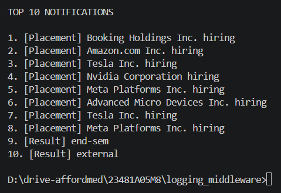

# Stage 1: Notification Fetch & Prioritization

## Approach
Use a JavaScript-based notification fetch pipeline that retrieves notifications from the evaluation-service API, logs each step through the middleware, then ranks and displays the top notifications to the user.

## Sorting Logic
1. Fetch all notifications from the remote API endpoint.
2. Sort notifications by their defined `Type` priority values.
3. For notifications with equal priority, sort by `Timestamp` descending so newer items appear first.
4. Slice the sorted list to produce the top 10 notifications for display.

## Priority Rules
- `Placement` notifications are highest priority.
- `Result` notifications are medium priority.
- `Event` notifications are lowest priority.

Priority mapping used in code:
- Placement = 3
- Result = 2
- Event = 1

## Efficiency
- The sort runs once on the complete list and then selects only the top 10 items.
- This keeps the workflow O(n log n) for sorting, with a constant-time slice operation for the final output.
- The implementation avoids repeated passes over the list by combining priority and timestamp ordering in a single comparator.

## Logging Middleware Usage
- Every major step is instrumented through `Log(...)` calls.
- The terminal output shows successful logging for each fetch attempt and the creation of log entries.
- Logs capture:
  - API fetch start
  - API fetch success
  - Top 10 notification calculation
- If the fetch fails, the middleware logs an error and the code prints the captured error details.

## Screenshots

### Stage 1 terminal output

